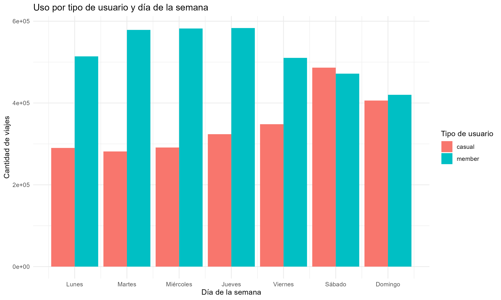
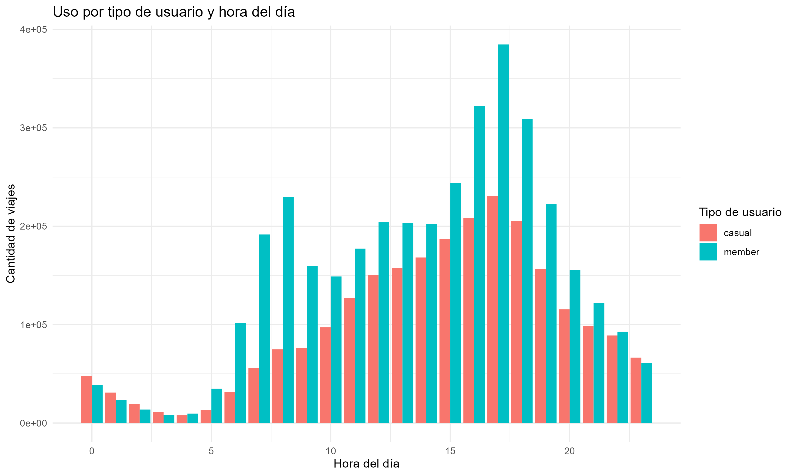

# Share cycle usage analysis

This repository provides a detailed analysis of shared bike system usage patterns by user type (members and occasional users). Examine usage differences by day of week and time of day and train a Ridge regularized logistic regression model to predict user types based on travel duration and day of week.

## table of contents

1. [Introduction](#Introduction)
2. [Methodology] (#Methodology)
3. [result](#result)
- [exploratory and descriptive analysis](#explorative-and-descriptive-analysis)
- [Predictive modeling] (#Predictive modeling)
4. [Talk] (#Talk)
5. [Conclusion] (#Conclusion)

## Prologue

The purpose of this project is to gain insight into the behavior of users of shared bike systems and tailor marketing and operational strategies to meet the needs of these different user segments. By analyzing the usage patterns of our members and occasional users, we would like to better understand their preferences and habits.

## methodology

The analysis follows these steps:

1. Read data files and combine them into a single data set.
2. Prepare and transform data to facilitate analysis.
3. Generate usage charts by day of the week and time of day. 4. Train and evaluate a ridge-regularized logistic regression model to predict user types.

## Results

### Exploratory and Descriptive Analysis

Investigating the data revealed significant differences between shared bike usage by members and temporary users.

- Member She uses the system more consistently throughout the week, but has occasional heavy users on weekends.
- Member usage peaks in the morning and evening, while occasional users peak in the afternoon, so the system is used evenly throughout the day.

### Predictive Modeling

Ridge regularized logistic regression models provide moderate accuracy in predicting user types.

- The best lambda value found is 0.001, giving an accuracy of about 63.74% for the model. - The model has low sensitivity (15.64%) and high specificity (95.63%).

## Discussion

Analysis suggests ways to adjust marketing and operational strategies.

- Targeted promotions can be offered to occasional users to encourage members to use the system during rush hours on weekdays when members use the system more frequently.
- You can consider other modeling techniques or including more variables in the model to improve performance.

## Diploma

This analysis provides valuable insight into user behavior of shared bike systems and suggests ways to adapt a company's strategy to the needs of different user segments. We recommend conducting further research and considering other modeling techniques to further improve our understanding of user behavior and the accuracy of user type predictions.  
